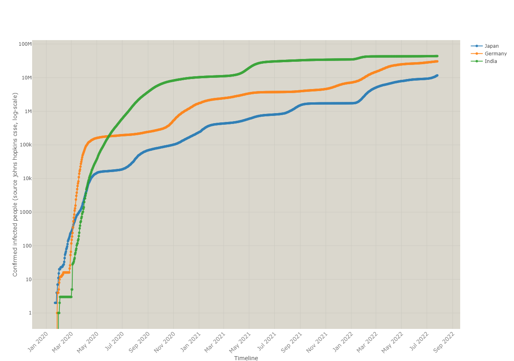

# Enterprise Data Science: COVID 19 Analysis

## Objective 

* To understand and learn the best practices of data science and translate them to develop a protoype for COVID analysis 
* To plot the confiremd cases, doubling rate and doubling time for all countries 
* To implement to a dynamic COVID-19 dashboard using (CRISP-DM) industry standard 
* To implement a SIR Model to generate COVID infection statistics 

In order to implement the dynamic dashboard, we need to understand the following:

* Business understanding (what is our goal)
* Data Understanding (where do we get data and cleaning of data)
* Data Preparation (data transformation and visualization)
* Modeling (Statistics, Machine Learning, and SIR Simulations on COVID Data)
* Deployment (how to deliver results, dynamic dashboards in python)

## First Delivery: Initial Delvery 

For first delivery, plots for the following have been generated 
* Relative COVID cases for all countries w.r.t time 
* Relative Vaccination for all countries w.r.t time 

## Final Delivery: 

The dynamic dashboard has been divided into the following sections:
* Timelines confirmed, doubling rate Timelines confirmed:confirmed cases for a specific country. Doubling rate: Time time taken for COVID cases to double. Doubling rate filtered: Doubling rate filtered using 'Savgol filter' for better forecast.

* An SIR model is an epidemiological model that computes the theoretical number of people infected with a contagious illness in a closed population over time. S: Susceptible, I: Infected, R: Recovered 1

* World map for all countries

## Final Dashboard

`source`1:https://mathworld.wolfram.com/SIRModel.html